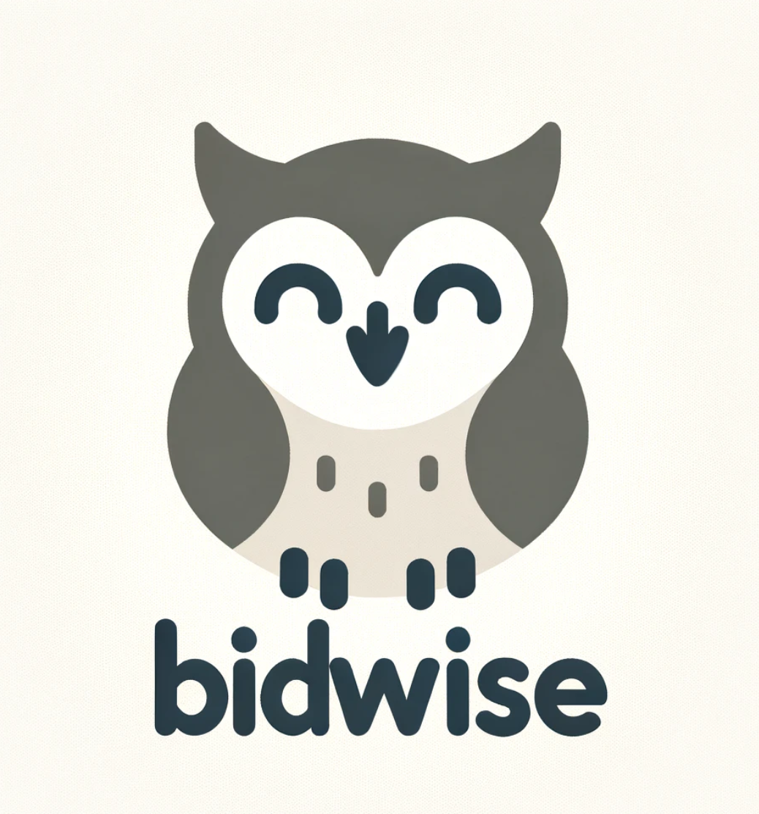
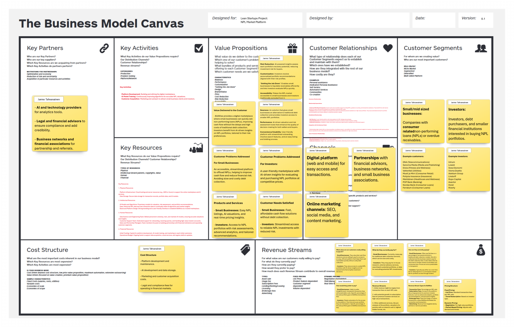

# BidWise: AI-Powered Marketplace for Non-Performing Loans (NPLs)

## Project Overview
BidWise is a school project aimed at creating an AI-powered digital marketplace that simplifies the trading of non-performing loans (NPLs). This platform concept seeks to help small to mid-sized businesses quickly sell their unpaid debts and offers investors easy access to valuable NPL portfolios. Through AI-driven insights, BidWise is designed to deliver fair valuations, reduce transaction times, and streamline the debt trading process.

## Objectives

- For Sellers: Provide a faster, cost-effective way to convert NPLs into cash without relying on traditional debt collection.
- For Investors: Offer data-backed insights and recommendations to make finding suitable NPL portfolios easier and more efficient.

## Features

- Automated Valuation: AI-based assessments of NPL portfolios for fair pricing.
- Risk Analysis: Insights into the risk associated with each portfolio, helping investors make informed decisions.
- Market Insights: Real-time trends and portfolio recommendations tailored to investor profiles.

## Project Components

- Market Research: Analysis of the NPL market, including pain points for sellers and buyers.
- Product Design: Conceptualization of the BidWise platform, including user flows and feature outlines.
- AI Model Development: Basic framework for valuation and risk analysis models.
- Documentation: Project milestones, challenges, and next steps toward potentially establishing BidWise as a business.

## Future Steps

- Conduct further market testing and user validation.
- Build more detailed framework and development map for AI models to use to gain competitive advantage. Play with the minimum viable AI models.
- Explore pathways to formally launch BidWise as a real-world solution.

## About the Team

BidWise needs to build a founding team.

Operations and Strategy Lead
- Responsibilities: Defining and managing operational workflows, strategic direction, and initial market positioning for BidWise. This role is focused on setting up smooth processes, coordinating between teams, and establishing clear goals and metrics for the company’s success.
- Suggested Person: [Jarmo Tahvanainen]

Product Development Lead
- Responsibilities: Overseeing the design and development of the BidWise platform, ensuring a user-friendly and intuitive interface for both sellers and investors. This role involves working closely with the technical team to define features, prioritize tasks, and continuously improve the platform.
- Suggested Person: [name]

Technical and Data Lead
- Responsibilities: Developing and maintaining BidWise’s core AI models for valuation, risk assessment, and recommendations. This role involves selecting and refining AI algorithms, managing data pipelines, and ensuring the platform’s backend is robust and scalable.
- Suggested Person: [name]

Business Development and Partnerships Lead
- Responsibilities: Building relationships with potential clients, investors, and strategic partners, and driving user acquisition. This role is essential for promoting BidWise to key stakeholders, developing partnerships, and understanding client needs for ongoing growth.
- Suggested Person: [name]

## Business Model Canvas

## Disclaimer

This project is currently in development as part of a school course and is not yet an operating business. The code and documentation here represent an academic project with potential for future development.